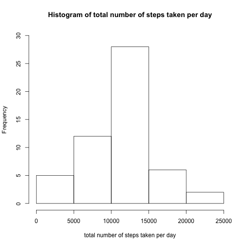
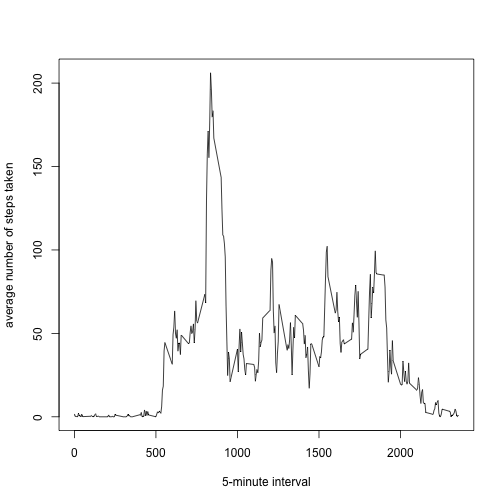
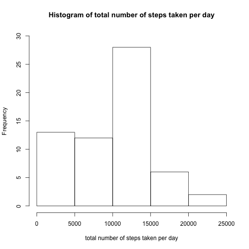
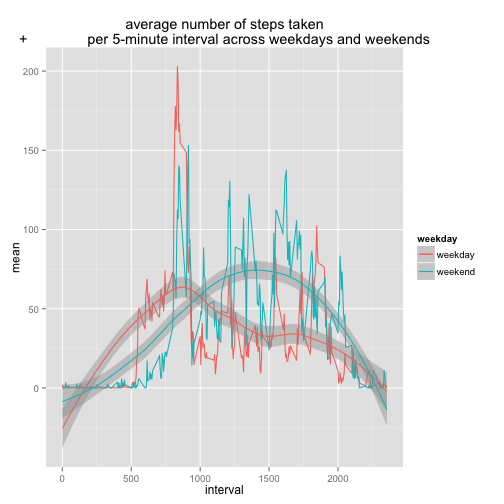

```r
Sys.setlocale("LC_ALL", 'en_US.UTF-8')
```

```
## [1] "en_US.UTF-8/en_US.UTF-8/en_US.UTF-8/C/en_US.UTF-8/en_US.UTF-8"
```
## Loading and preprocessing the data

```r
library(dplyr)
```

```
## 
## Attaching package: 'dplyr'
## 
## The following object is masked from 'package:stats':
## 
##     filter
## 
## The following objects are masked from 'package:base':
## 
##     intersect, setdiff, setequal, union
```

```r
library(ggplot2)
```


```r
dat <- read.csv("activity.csv")
```

```r
head(dat)
```

## What is mean total number of steps taken per day?

```r
dat_sub <- summarize(group_by (dat, date), sum = sum(steps))
```

```r
hist(dat_sub$sum, main = "Histogram of total number of steps taken per day", ylim = c(0, 30), xlab= "total number of steps taken per day")
```

 

```r
mean_dat_sub <- format(mean ( dat_sub$sum, na.rm = TRUE), digits = 9)
median_dat_sub <- format(median(dat_sub$sum, na.rm = TRUE), digits = 9)
```

The mean of total number of steps taken per day is 10766.1887 and the median 10765

## What is the average daily activity pattern?


```r
dat_sum <- summarize(group_by (dat, interval),  mean = mean(steps, na.rm = TRUE))
```

```r
plot(dat_sum$interval, dat_sum$mean, type = "l", xlab = "5-minute interval", ylab = "average number of steps taken")
```

 

```r
res <- filter(dat_sum, mean == max(dat_sum$mean))
```


The 5-minute interval, on average across all the days in the dataset that contains the maximum number of steps of 206.1698113 is 835

## Imputing missing values


```r
length(which(is.na(dat$date)))
```

```
## [1] 0
```

```r
length(which(is.na(dat$interval)))
```

```
## [1] 0
```

```r
length(which(is.na(dat$steps)))
```

```
## [1] 2304
```
Only the variable steps, has NA values, in a total of 2304


```r
dat2 <- dat
dat2[is.na(dat2)] <- 0
```

```r
dat_sub2 <- summarize(group_by (dat2, date), sum = sum(steps))
```

```r
hist(dat_sub2$sum, main = "Histogram of total number of steps taken per day", ylim = c(0, 30), xlab= "total number of steps taken per day")
```

 

```r
mean_dat_sub2 <- format(mean ( dat_sub2$sum, na.rm = TRUE), digits = 9)
median_dat_sub2 <- format(median(dat_sub2$sum, na.rm = TRUE), digits = 9)
```

The mean of total number of steps taken per day is 9354.22951 and the median 10395, transforming NAs in zeros

The histogram and the values of the mean and median  are diffrent when using the dataframe with NAs, because now, the number of observations is greater , as long we didn`t use the na.rm = TRUE directive when summing up the steps
So, the histogram now presents more observations in the range 0-5000, and the mean and median have a lower value.

## Are there differences in activity patterns between weekdays and weekends?


```r
dat3 <- mutate (dat2, weekday = weekdays(as.Date(date)))
dat4 <- mutate(dat3, weekday = gsub("Saturday", "weekend", dat3$weekday))
dat4 <- mutate(dat4, weekday = gsub("Sunday", "weekend", dat4$weekday))
dat4 <- mutate(dat4, weekday = gsub("Monday", "weekday", dat4$weekday))
dat4 <- mutate(dat4, weekday = gsub("Tuesday", "weekday",dat4$weekday))
dat4 <- mutate(dat4, weekday = gsub("Wednesday", "weekday", dat4$weekday))
dat4 <- mutate(dat4, weekday = gsub("Thursday", "weekday", dat4$weekday))
dat4 <- mutate(dat4, weekday = gsub("Friday", "weekday", dat4$weekday))
dat4 <- mutate(dat4, weekday = as.factor(weekday))
```

```r
dat_sub4 <- summarize(group_by (dat4, interval,weekday), mean = mean(steps))
```


```r
 ggplot(data = dat_sub4, aes(x=interval, y=mean)) + geom_line(aes(colour=weekday)) +  geom_smooth(aes(colour=weekday)) + labs(title = "average number of steps taken
+               per 5-minute interval across weekdays and weekends" )
```

```
## geom_smooth: method="auto" and size of largest group is <1000, so using loess. Use 'method = x' to change the smoothing method.
```

 


There is a difference in activity pattern when considering weekdays and weekends. The activity in weekends is higher than weekdays.
